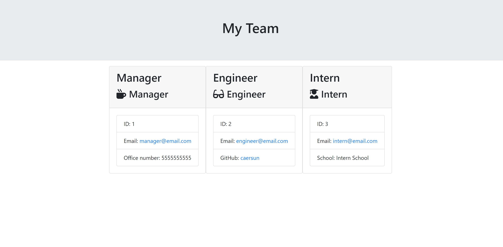

# employee-engine
The "Employee Engine" is a command-line application that generates an HTML file of managerial and team information from user input. Assuming the user is team manager, user is prompted for information for themselves and optional further team members, which can be a mix of engineers and interns. 

## Demonstration
To view a walkthrough of app functionality, click [HERE](https://drive.google.com/file/d/1hXLc6dolQ3U6lKjIXUiXIc0yOtFKsyEp/view)

## Installation
Initialize employee-engine by installing necessary dependencies with `npm install` or `npm i`. Then, in the command-line or terminal, move into the directory and start application with `node app.js`. 

## Technologies Used
* HTML5
* Bootstrap
* JavaScript
* Node.js
* Inquirer.js
* Jest.js

## What It Looks Like

## License
Licensed under the MIT License

## Questions
Contact me with any further questions: 
- [Email](i.cynthiagarcia@gmail.com)  
- [Portfolio](https://caersun.github.io/portfolio/)

